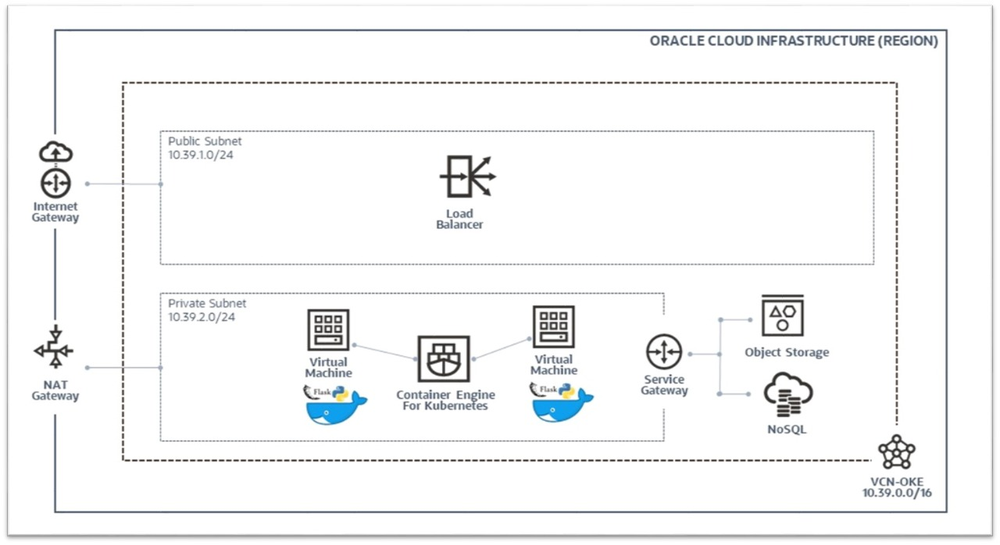
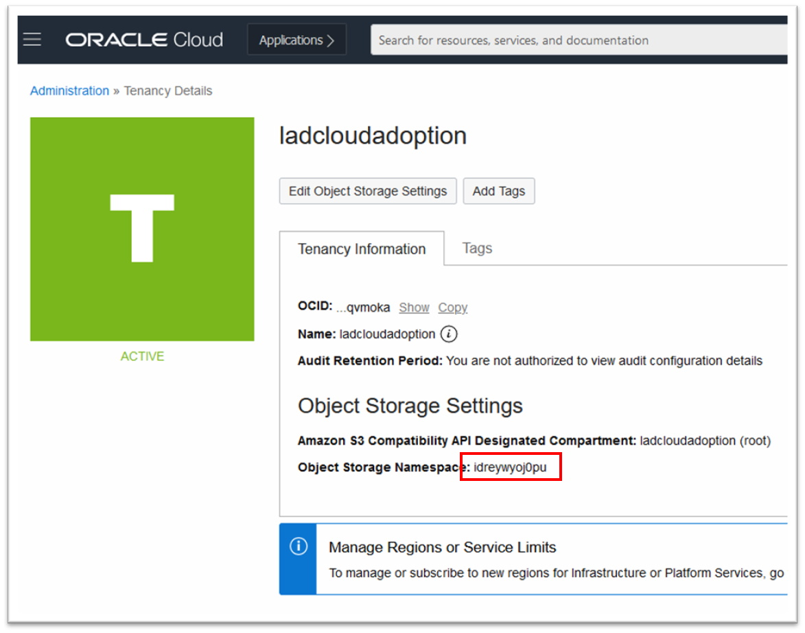
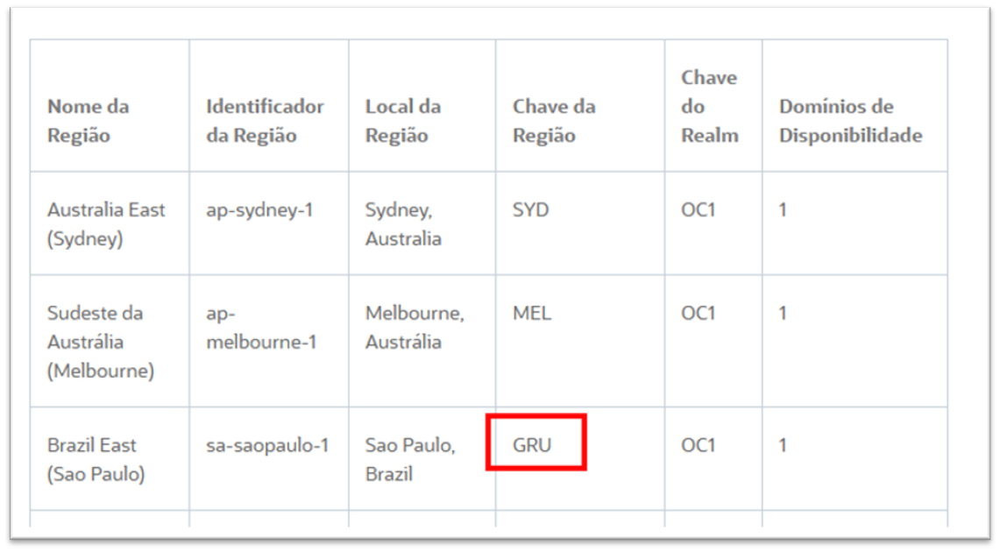
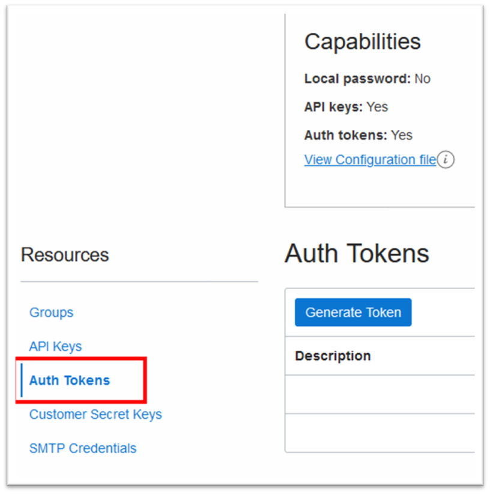
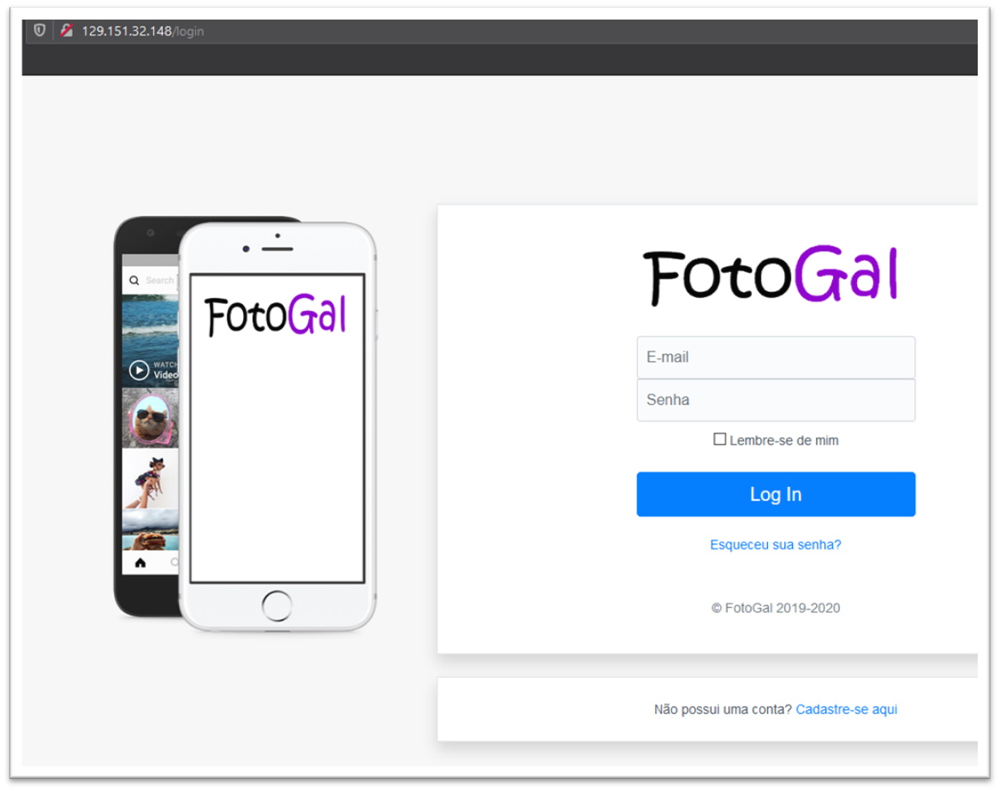

# FotoGal (Foto Galeria)

**_FotoGal (Foto Galeria)_** is a _Web/Cloud Native_ application written using the _[Python](https://www.python.org/)/[Flask](https://flask.palletsprojects.com)_ framework, on the _[Oracle Cloud (OCI)](https://www.oracle.com/br/cloud/)_ infrastructure. The application is a _[“proof of concept” (PoC)](https://en.wikipedia.org/wiki/Proof_of_concept),_ which mimics the basic features of the _[Instagram](https://www.instagram.com/)_ application on the services available at _[OCI](https://www.oracle.com/br/cloud/)_.

For now, the application **_FotoGal_** uses the following services from _[OCI](https://www.oracle.com/cloud/)_:

*  [Object Storage](https://docs.oracle.com/en-us/iaas/Content/Object/Concepts/objectstorageoverview.htm)

*  [NoSQL Database](https://docs.oracle.com/en-us/iaas/nosql-database/index.html)

*  [Log](https://docs.oracle.com/en-us/iaas/Content/Logging/Concepts/loggingoverview.htm)

*  [Container Engine (Kubernetes)](https://docs.oracle.com/en-us/iaas/Content/ContEng/Concepts/contengoverview.htm)

*  [Load Balancer](https://docs.oracle.com/en-us/iaas/Content/Balance/Concepts/balanceoverview.htm)

## Table of contents

* Topology
* Description of directories (source code)
* Prerequisites
* How to use

## Topology



## Description of directories (source code)

```
.
├── README.md                   # README
├── LICENSE
├── requirements.txt            # Python project dependencies
├── Dockerfile                  # Definitions for building the Docker container
├── gthimgs/                    # GitHub Markdown images
├── terraform/                  # Infrastructure as code (IaC) Terraform
├── tools/                      # Miscellaneous scripts / utilities
└── fotogal/                    # Root directory of the FotoGal application
     ├── app/                   # FotoGal application directory (Flask)
     ├── oci_config/            # OCI SDK / CLI configuration files
     └── entrypoint.sh          # Docker container bootstrap script
```

## Prerequisites

*  [A valid OCI account ](https://www.oracle.com/cloud/free/)
*  [Oracle Linux 7 (for creating / sending the application container to the OCI)](https://www.oracle.com/linux/)
*  [Oracle Cloud CLI](https://docs.oracle.com/en-us/iaas/Content/API/SDKDocs/cliinstall.htm#InstallingCLI__PromptsInstall)
*  [Terraform](https://www.terraform.io/downloads.html)
*  [Kubectl](https://kubernetes.io/docs/tasks/tools/install-kubectl/)

*  [Docker](https://docs.docker.com/engine/)

## How to use

1. Install _Oracle Cloud CLI_ on the machine [Oracle Linux 7](https://www.oracle.com/linux/):

*  [Oracle Cloud CLI](https://docs.oracle.com/en-us/iaas/Content/API/SDKDocs/cliinstall.htm#InstallingCLI__PromptsInstall)

```
[darmbrust@oci-dev ~]$ bash -c "$(curl -L https://raw.githubusercontent.com/oracle/oci-cli/master/scripts/install/install.sh)"
```

```
[darmbrust@oci-dev ~]$ oci -v
2.20.0
```

2. Install the _Terraform_ and _kubectl_ binaries:

*  [Terraform](https://www.terraform.io/downloads.html)

```
[darmbrust@oci-dev ~]$ wget https://releases.hashicorp.com/terraform/0.14.5/terraform_0.14.5_linux_amd64.zip -P bin/

[darmbrust@oci-dev ~]$ unzip bin/terraform_0.14.5_linux_amd64.zip -d bin/
```

```
[darmbrust@oci-dev ~]$ bin/terraform -v

Terraform v0.14.5
```

*  [Kubectl](https://kubernetes.io/docs/tasks/tools/install-kubectl/)

```
[darmbrust@oci-dev ~]$ cd bin/

[darmbrust@oci-dev bin]$ curl -LO "https://dl.k8s.io/release/$(curl -L -s https://dl.k8s.io/release/stable.txt)/bin/linux/amd64/kubectl"

[darmbrust@oci-dev bin]$ chmod +x kubectl
```

```
[darmbrust@oci-dev bin]$ ./kubectl version --short
Client Version: v1.20.2
```


3. Install _Docker_:

*  [Docker](https://www.docker.com/)

```
[darmbrust@oci-dev ~]$ sudo yum install -y docker-engine
```

```
[darmbrust@oci-dev ~]$ sudo systemctl enable docker.service
[darmbrust@oci-dev ~]$ sudo systemctl start docker.service
```

```
[darmbrust@oci-dev ~]$ docker -v
Docker version 19.03.11-ol, build 748876d
```

4. With the utilities already installed, _“clone”_ the _FotoGal_ application repository:

```
[darmbrust@oci-dev ~]$ sudo yum install -y git
```


```
[darmbrust@oci-dev ~]$ git clone https://github.com/daniel-armbrust/fotogal.git
```

```
[darmbrust@oci-dev ~]$ cd fotogal/
[darmbrust@oci-dev fotogal]$ mkdir fotogal/oci_config/
```

5. Create a public and private key (without password), to use the _[SDK](https://docs.oracle.com/en-us/iaas/Content/API/SDKDocs/pythonsdk.htm)_ from _OCI_:

```
[darmbrust@oci-dev fotogal]$ openssl genrsa -out fotogal/oci_config/oci_api_key.pem 2048
[darmbrust@oci-dev fotogal]$ chmod 0400 fotogal/oci_config/oci_api_key.pem

[darmbrust@oci-dev fotogal]$ openssl rsa -pubout -in fotogal/oci_config/oci_api_key.pem -out fotogal/oci_config/oci_api_key_public.pem
```

* The **_public key_** will not be used by the application. It must be inserted into your user on _OCI_.

6. Create a configuration file in the following format below:

```
[darmbrust@oci-dev fotogal]$ cat fotogal/oci_config/oci.conf
[DEFAULT]
user=<USER OCID>
fingerprint=<KEY FINGERPRINT>
tenancy=<TENANCY OCID>
region=<OCI REGION>
compartment=<YOUR OCID ROOT COMPARTMENT>
```


* Fill in the highlighted fields with the appropriate values of your _user/tenant_ on _OCI_. For more information, consult the official documentation: _[Required Keys and OCIDs](https://docs.oracle.com/en-us/iaas/Content/API/Concepts/apisigningkey.htm)_

7. Create the _Docker image_:



* Obtain the value for the **_Region Key_** corresponding to the _OCI_ region in which the application will be deployed. See the official documentation _[Regions and Availability Domains](https://docs.oracle.com/en-us/iaas/Content/General/Concepts/regions.htm)_ for other values. Here, we will use _GRU_ which corresponds to _São Paulo, Brazil_.





* Create the **_TAG_** used to build the _image_ which must comply with the standard:

**_&lt;Region Key>_.ocir.io/_&lt;Tenancy Namespace>_/_&lt;User/Repository>_/_&lt;Name/Application Version>_**

* Example:

**_gru_**.ocir.io/**_idreywyoj0pu_**/**_daniel.armbrust_**/**_fotogal_**:**_1.0.0_**

```
[darmbrust@oci-dev fotogal]$ sudo docker build -t gru.ocir.io/idreywyoj0pu/daniel.armbrust/fotogal:1.0.0 .
```

```
[darmbrust@oci-dev fotogal]$ sudo docker images
REPOSITORY                                         TAG      IMAGE ID       CREATED SIZE
gru.ocir.io/idreywyoj0pu/daniel.armbrust/fotogal   1.0.0    d0c540b17d3a   2 days ago 388MB
python 3.8-alpine                                           024f9f60790b   5 days ago 43.1MB
```

8.  Create an _Authentication Token_ to send the _Docker image_ created to _OCI_.




9. Send the _Docker image_ that was created to _OCI_:

* Perform _login_ in the _OCIR_ service, informing your _username_ and the **_Authentication Token_** that was created. Recalling that in this example, we are using the _OCI_ services present in the _São Paulo, Brazil (GRU)_ region.

* For more information on the entire process of sending _Docker_ images to _OCI_, see the official documentation: _[Push an Image to Oracle Cloud Infrastructure Registry](https://www.oracle.com/webfolder/technetwork/tutorials/obe/oci/registry/index.html)_


```
[darmbrust@oci-dev fotogal]$ sudo docker login -u idreywyoj0pu/oracleidentitycloudservice/daniel.armbrust@oracle.com gru.ocir.io
```

* Send the _Docker image_ to the _OCIR_ service:

```
[darmbrust@oci-dev fotogal]$ sudo docker push gru.ocir.io/idreywyoj0pu/daniel.armbrust/fotogal:1.0.0
```

```
[darmbrust@oci-dev fotogal]$ sudo docker logout
```

10. Create the infrastructure in _OCI_ using the _Terraform_ scripts.

* Within the **_terraform/_** directory, create the resources:

```
[darmbrust@oci-dev fotogal]$ cd terraform/
[darmbrust@oci-dev terraform]$ terraform init
[darmbrust@oci-dev terraform]$ terraform apply -auto-approve
```

11. Create the necessary settings to connect to the _Kubernetes_ cluster from **_kubectl_**:

* Before configuring **_kubectl_**, we must perform the configurations _[OCI CLI](https://docs.oracle.com/en-us/iaas/Content/API/Concepts/cliconcepts.htm)_ with the command:

```
[darmbrust@oci-dev fotogal]$ oci setup config
```

* After the _Kubernetes_ cluster is created, it will be necessary to obtain its _OCID_:

```
[darmbrust@oci-dev fotogal]$ oci ce cluster list --compartment-id ocid1.compartment.oc1..aaaaaaaaro7baesjtceeuntyqxajzotsthm4bg46bwumacmbltuhw6gvb2mq
--name oke-fotogal --query "data|[0].id"
```

* Fill in the command below with the respective _OCID_ value of the _cluster Kubernetes_ that was created:

```
[darmbrust@oci-dev fotogal]$ oci ce cluster create-kubeconfig --cluster-id <CLUSTER  OCID> --file $HOME/.kube/config --region sa-saopaulo-1 --token-version 2.0.0
New config written to the Kubeconfig file /home/darmbrust/.kube/config
```

12. Check connectivity with the _cluster Kubernetes_ created in _OCI_:

```
[darmbrust@oci-dev fotogal]$ kubectl cluster-info
```

13. Create a _"secret"_ to allow the _Kubernetes cluster_ to access the _Docker image_ repository in _OCI_:

```
[darmbrust@oci-dev fotogal]$ kubectl create secret docker-registry fotogal-ocir-secret --docker-server=gru.ocir.io --docker-username='idroay2yZj0pu/oracleidentitycloudservice/daniel.armbrust@algumdominio.com' --docker-password='<TOKEN  DE  AUTENTICAÇÃO>'
```

* To create this _“secret”_, we need to inform in the _Kubernetes cluster_ the **_OCIR service region (gru.ocir.io)_** along with the **_access credentials (username and authentication token)_**.

* For more information about the image download process by _cluster Kubernetes at OCI_, consult the official documentation: _[Pulling Images from Registry during Deployment](https://docs.oracle.com/en-us/iaas/Content/ContEng/Tasks/contengpullingimagesfromocir.htm)_

14. Set the file **_terraform/yaml/fotogal-deploy.yaml_** with the path of the _Docker image_ according to the _OCIR_ information created in your _Tenancy_:

```
[darmbrust@oci-dev fotogal]$ cd terraform/yaml/

[root@localhost yaml]# cat fotogal-deploy.yaml
apiVersion: apps/v1
kind: Deployment
metadata:
  name: fotogal-dpp
spec:
  replicas: 3
  selector:
       matchLabels:
         app: fotogal
  template:
    metadata:
       labels:
         app: fotogal
    spec:
       containers:
       - name: fotogal-container
         image: gru.ocir.io/idroay2yZj0pu/daniel.armbrust/fotogal:1.0.0
         env:
         - name: SECRET_KEY
           value: "258166fe81d609c00ba2b0728e33333333a80d323a85c124f3fa554c585"
         - name: WTF_CSRF_SECRET_KEY
           value: "258166fe81d609c00ba2C0728e88dEf52zzzzd323a85c124f3fa554c585"
         - name: AUTH_COOKIE_SECRET_KEY
           value: "rEw4qpfSB-FTtA1bSwXZ3iGx_cCh6J62VL0foa34521cKfNE="
         ports:
         - containerPort: 5000
           protocol: TCP
       imagePullSecrets:
         - name: fotogal-ocir-secret
---
apiVersion: v1
kind: Service
metadata:
  name: fotogal-srv
  annotations:
       service.beta.kubernetes.io/oci-load-balancer-shape: 10Mbps
spec:
  type: LoadBalancer
  selector:
       app: fotogal
  ports:
  - port: 80
       protocol: TCP
       targetPort: 5000

```

15. Deploy the application to _Kubernetes cluster_ using the command below:

```
[darmbrust@oci-dev fotogal]$ kubectl create -f fotogal-deploy.yaml
```

16. After a few seconds, you can get the _public IP_ address from _[Load Balancer](https://docs.oracle.com/en-us/iaas/Content/Balance/Concepts/balanceoverview.htm)_ created by _Kubernetes cluster_:

```
[darmbrust@oci-dev fotogal]$ kubectl get service fotogal-srv
NAME         TYPE          CLUSTER-IP    EXTERNAL-IP     PORT(S)        AGE
fotogal-srv  LoadBalancer  10.96.6.189   129.151.32.148  80:31399/TCP   46s
```

17. Before accessing the application, let's load some data for demonstration by executing the commands below:


```
[darmbrust@oci-dev fotogal]$ sudo pip3 install borneo werkzeug
[darmbrust@oci-dev tools]$ cd tools/
[darmbrust@oci-dev tools]$ python3 ./add_initial_users.py
```

18. Done! Just access the application through the _public IP_ of the _[Load Balancer](https://docs.oracle.com/pt-br/iaas/Content/Balance/Concepts/balanceoverview.htm)_:


