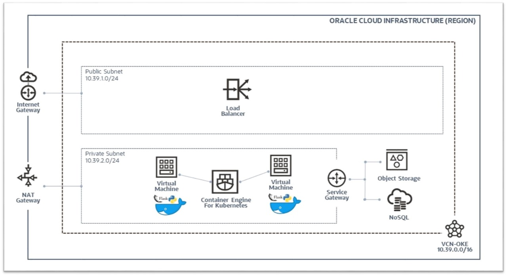
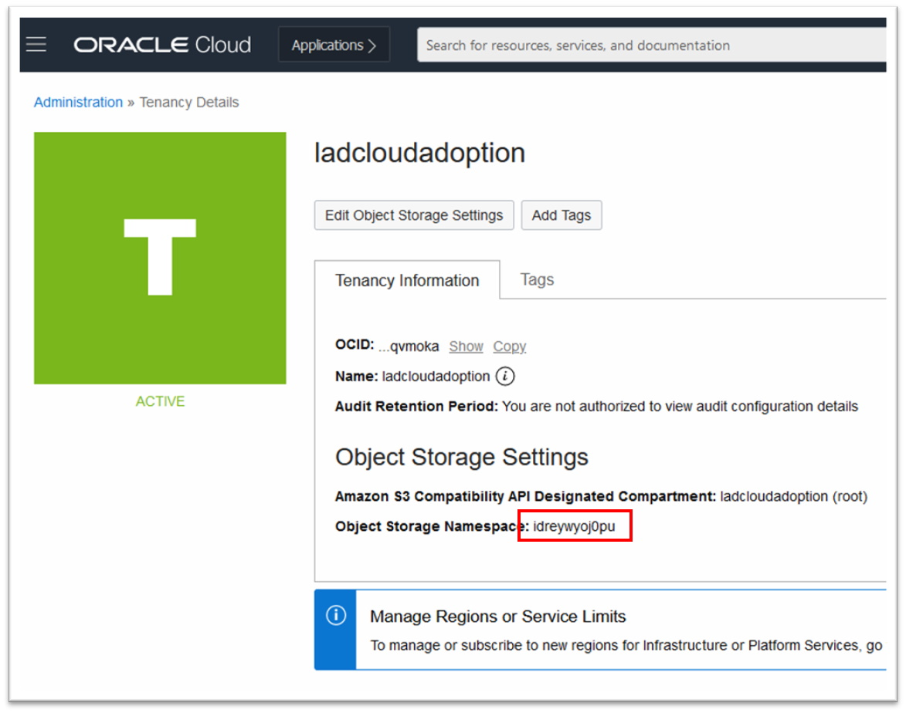
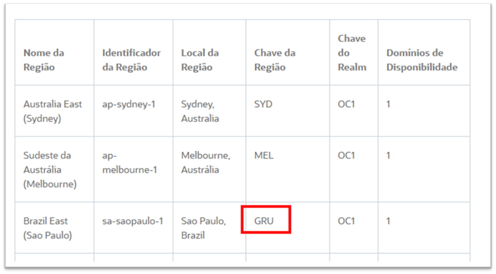
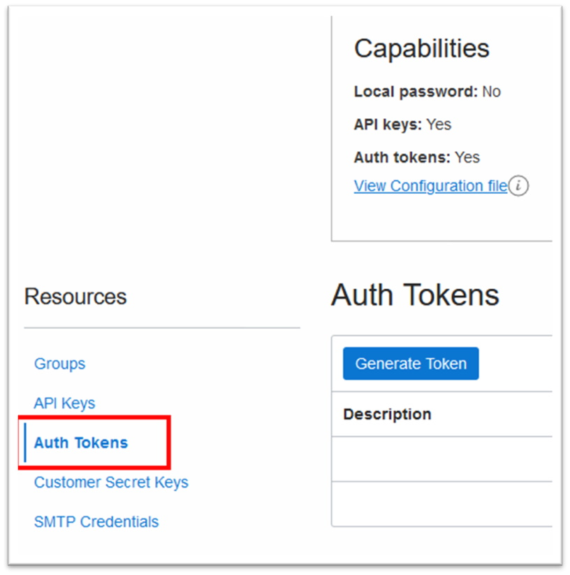
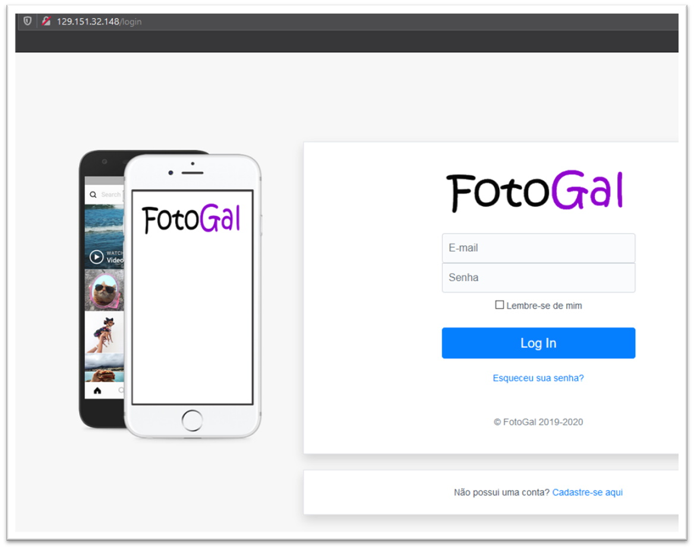

# FotoGal (Foto Galeria)

  

[
](https://github.com/daniel-armbrust/fotogal/archive/main.zip)

  

**_FotoGal (Foto Galeria)_** é uma aplicação _Web/Cloud Native_ escrita utilizando o framework _[Python](https://www.python.org/)/[Flask](https://flask.palletsprojects.com)_, sobre a infraestrutura da _[Oracle Cloud (OCI)](https://www.oracle.com/br/cloud/)_. A aplicação é uma _[“prova de conceito” (PoC)](https://pt.wikipedia.org/wiki/Prova_de_conceito),_ que imita as funcionalidades básicas da aplicação _[Instagram](https://www.instagram.com/)_ sobre os serviços disponíveis no _[OCI](https://www.oracle.com/br/cloud/)_.

Por enquanto, a aplicação **_FotoGal_** utiliza os seguintes serviços do _[OCI](https://www.oracle.com/br/cloud/)_:

*  [Object Storage](https://docs.oracle.com/pt-br/iaas/Content/Object/Concepts/objectstorageoverview.htm)

*  [Banco de Dados NoSQL](https://docs.oracle.com/pt-br/iaas/nosql-database/index.html)

*  [Log](https://docs.oracle.com/pt-br/iaas/Content/Logging/Concepts/loggingoverview.htm)

*  [Container Engine (Kubernetes)](https://docs.oracle.com/pt-br/iaas/Content/ContEng/Concepts/contengoverview.htm)

*  [Load Balancer](https://docs.oracle.com/pt-br/iaas/Content/Balance/Concepts/balanceoverview.htm)

## Índice

* Topologia
* Descrição dos diretórios (código-fonte)
* Pré-requisitos
* Como utilizar

## Topologia



## Descrição dos diretórios (código-fonte)
```

.
├── README.md                   # README
├── README.pt-BR.md             # README (pt-BR)
├── LICENSE
├── CHANGELOG.md                # Listagem das últimas alterações feitas no projeto
├── requirements.txt            # Dependências do projeto Python
├── Dockerfile                  # Definições para construção do contêiner Docker
├── gthimgs/                    # GitHub Markdown images
├── iac/                        # Infraestrutura como código (IaC) Terraform
│    ├── hml/                   # IaC Terraform para ambiente de Homologação
│    ├── dev/                   # IaC Terraform para ambiente de Desenvolvimento
│    ├── prd/                   # IaC Terraform para ambiente de Produção
│    ├── yaml/                  # Arquivos YAML descritores Kubernetes
│    └── run.sh                 # Script helper para execução do Terraform
├── tools/                      # Scripts/utilitários diversos
└── fotogal/                    # Diretório raíz da aplicação FotoGal
     ├── app/                   # Diretório da aplicação FotoGal (Flask)
     ├── oci_config/            # Arquivos de configuração do OCI SDK/CLI
     └── entrypoint.sh          # Script bootstrap do contêiner Docker
     
```

## Pré-requisitos

*  [Uma conta válida no OCI](https://www.oracle.com/br/cloud/free/)
*  [Oracle Linux 7 (para criação/envio do contêiner da aplicação ao OCI)](https://www.oracle.com/br/linux/)
*  [Oracle Cloud CLI](https://docs.oracle.com/pt-br/iaas/Content/API/SDKDocs/cliinstall.htm#InstallingCLI__PromptsInstall)
*  [Terraform](https://www.terraform.io/downloads.html)
*  [Kubectl](https://kubernetes.io/docs/tasks/tools/install-kubectl/)

*  [Docker](https://docs.docker.com/engine/)

## Como utilizar

1. Instalar o _Oracle Cloud CLI_ na máquina [Oracle Linux 7](https://www.oracle.com/br/linux/):

*  [Oracle Cloud CLI](https://docs.oracle.com/pt-br/iaas/Content/API/SDKDocs/cliinstall.htm#InstallingCLI__PromptsInstall)

```

[darmbrust@oci-dev ~]$ bash -c "$(curl -L https://raw.githubusercontent.com/oracle/oci-cli/master/scripts/install/install.sh)"

```

```

[darmbrust@oci-dev ~]$ oci -v
2.20.0

```
  
2. Instalar os binários do _Terraform_ e _kubectl_:

*  [Terraform](https://www.terraform.io/downloads.html)

```

[darmbrust@oci-dev ~]$ wget https://releases.hashicorp.com/terraform/0.14.5/terraform_0.14.5_linux_amd64.zip -P bin/

[darmbrust@oci-dev ~]$ unzip bin/terraform_0.14.5_linux_amd64.zip -d bin/

```

```

[darmbrust@oci-dev ~]$ bin/terraform -v

Terraform v0.14.5

```

*  [Kubectl](https://kubernetes.io/docs/tasks/tools/install-kubectl/)

```

[darmbrust@oci-dev ~]$ cd bin/

[darmbrust@oci-dev bin]$ curl -LO "https://dl.k8s.io/release/$(curl -L -s https://dl.k8s.io/release/stable.txt)/bin/linux/amd64/kubectl"

[darmbrust@oci-dev bin]$ chmod +x kubectl

```

```

[darmbrust@oci-dev bin]$ ./kubectl version --short
Client Version: v1.20.2

```
  

3. Instalar o _Docker_:

*  [Docker](https://www.docker.com/)

```

[darmbrust@oci-dev ~]$ sudo yum install -y docker-engine

```

```

[darmbrust@oci-dev ~]$ sudo systemctl enable docker.service
[darmbrust@oci-dev ~]$ sudo systemctl start docker.service

```

```

[darmbrust@oci-dev ~]$ docker -v
Docker version 19.03.11-ol, build 748876d

```

4. Com os utilitários já instalados, _“clonar”_ o repositório da aplicação _FotoGal_:

```

[darmbrust@oci-dev ~]$ sudo yum install -y git

```


```

[darmbrust@oci-dev ~]$ git clone https://github.com/daniel-armbrust/fotogal.git

```

```

[darmbrust@oci-dev ~]$ cd fotogal/
[darmbrust@oci-dev fotogal]$ mkdir fotogal/oci_config/

```

5. Criar uma chave pública e privada (sem senha), para utilizar o _[SDK](https://docs.oracle.com/pt-br/iaas/Content/API/SDKDocs/pythonsdk.htm)_ do _OCI_:

```

[darmbrust@oci-dev fotogal]$ openssl genrsa -out fotogal/oci_config/oci_api_key.pem 2048
[darmbrust@oci-dev fotogal]$ chmod 0400 fotogal/oci_config/oci_api_key.pem

[darmbrust@oci-dev fotogal]$ openssl rsa -pubout -in fotogal/oci_config/oci_api_key.pem -out fotogal/oci_config/oci_api_key_public.pem  

```

* A chave pública não será usada pela aplicação. A mesma deve inserida ao seu usuário no _OCI_.

6. Criar um arquivo de configuração no seguinte formato abaixo:

```

[darmbrust@oci-dev fotogal]$ cat fotogal/oci_config/oci.conf
[DEFAULT]
user=<USER OCID>
fingerprint=<KEY FINGERPRINT>
tenancy=<TENANCY OCID>
region=<OCI REGION>
compartment=<YOUR OCID ROOT COMPARTMENT>

```


* Preencher os campos em destaque com os valores apropriados do seu _usuário/tenant_ no _OCI_. Para maiores informações, consulte a documentação oficial: _[Chaves e OCIDs Necessários](https://docs.oracle.com/pt-br/iaas/Content/API/Concepts/apisigningkey.htm)_

7. Criar a _imagem Docker_:



* Obter o valor para a **_Chave da Região_** correspondente a região do _OCI_ no qual o deploy da aplicação será feito. Consulte a documentação oficial _[Regiões e Domínios de Disponibilidade](https://docs.oracle.com/pt-br/iaas/Content/General/Concepts/regions.htm)_ para outros valores. Aqui, iremos utilizar _GRU_ que corresponde a _São Paulo, Brazil_.
  




* Criar a **_TAG_**  utilizada para construção da _imagem _que deve obedecer ao padrão:

**_&lt;Chave da Região>_.ocir.io/_&lt;Tenancy Namespace>_/_&lt;Usuário/Repositório>_/_&lt;Nome/Versão da Aplicação>_**

* Exemplo:

**_gru_**.ocir.io/**_idreywyoj0pu_**/**_daniel.armbrust_**/**_fotogal_**:**_1.0.0_**

```

[darmbrust@oci-dev fotogal]$ sudo docker build -t gru.ocir.io/idreywyoj0pu/daniel.armbrust/fotogal:1.0.0 .

```

```

[darmbrust@oci-dev fotogal]$ sudo docker images
REPOSITORY                                         TAG      IMAGE ID       CREATED SIZE
gru.ocir.io/idreywyoj0pu/daniel.armbrust/fotogal   1.0.0    d0c540b17d3a   2 days ago 388MB
python 3.8-alpine                                           024f9f60790b   5 days ago 43.1MB

```

8. Criar um _Token de Autenticação_ para envio da _imagem Docker_ criada ao _OCI_.




9. Enviar a _imagem Docker_ que foi criada ao _OCI_:

* Realizar o _login_ no serviço _OCIR_, informando seu _nome de usuário_ e o **_Token de Autenticação_** que foi criado. Lembrando que neste exemplo, estamos utilizando os serviços do _OCI_ presentes na região _São Paulo, Brazil (GRU)_.

* Para maiores informações sobre todo o processo de envio de _imagens Docker_ ao _OCI_, consulte a documentação oficial: _[Push an Image to Oracle Cloud Infrastructure Registry](https://www.oracle.com/webfolder/technetwork/tutorials/obe/oci/registry/index.html)_

  

```

[darmbrust@oci-dev fotogal]$ sudo docker login -u idreywyoj0pu/oracleidentitycloudservice/daniel.armbrust@oracle.com gru.ocir.io

```

  
  

* Enviar a _imagem Docker_ ao serviço _OCIR_:

  

```

[darmbrust@oci-dev fotogal]$ sudo docker push gru.ocir.io/idreywyoj0pu/daniel.armbrust/fotogal:1.0.0

```

  
  
  

```

[darmbrust@oci-dev fotogal]$ sudo docker logout

```

  
  

10. Criar a infraestrutura no _OCI_ utilizando os scripts _Terraform_.

* Dentro do diretório **_iac/_** foi criado o script **_run.sh_** que facilita a execução dos comandos do _Terraform_. Para criar os recursos do ambiente de produção, execute os comandos:

  

```

[darmbrust@oci-dev fotogal]$ cd iac/

```

```

[darmbrust@oci-dev iac]$ ./run.sh -p init
[darmbrust@oci-dev iac]$ ./run.sh -p apply -f

```

11. Criar as configurações necessárias para conexão ao cluster _Kubernetes_ a partir do **_kubectl_**:

* Antes de configurar o **_kubectl_**, devemos realizar as configurações _[OCI CLI](https://docs.oracle.com/pt-br/iaas/Content/API/Concepts/cliconcepts.htm)_ com o comando:

```

[darmbrust@oci-dev fotogal]$ oci setup config

```
  

* Após o cluster _Kubernetes_ ser criado, será necessário obter o _OCID_ do mesmo:

```

[darmbrust@oci-dev fotogal]$ oci ce cluster list --compartment-id ocid1.compartment.oc1..aaaaaaaaro7baesjtceeuntyqxajzotsthm4bg46bwumacmbltuhw6gvb2mq 
--name oke-fotogal --query "data|[0].id"

```
  

* Preencha o comando abaixo com o respectivo valor _OCID_ do _cluster Kubernetes_ que foi criado:
 

```

[darmbrust@oci-dev fotogal]$ oci ce cluster create-kubeconfig --cluster-id <CLUSTER  OCID> --file $HOME/.kube/config --region sa-saopaulo-1 --token-version 2.0.0
New config written to the Kubeconfig file /home/darmbrust/.kube/config

```
  

* Para maiores informações sobre o processo de criação de um _cluster Kubernetes_ no _OCI_, consulte a documentação oficial: _[Create a Cluster with Oracle Cloud Infrastructure Container Engine for Kubernetes](https://www.oracle.com/webfolder/technetwork/tutorials/obe/oci/oke-full/index.html)_

12. Verifique a conectividade com o _cluster Kubernetes_ criado no _OCI_:
  

```

[darmbrust@oci-dev fotogal]$ kubectl cluster-info

```
  

13. Criar um _“segredo”_ para permitir que o _cluster Kubernetes_ acesse o repositório de _imagens Docker_ no _OCI_:

```

[darmbrust@oci-dev fotogal]$ kubectl create secret docker-registry fotogal-ocir-secret --docker-server=gru.ocir.io --docker-username='idreywyoj0pu/oracleidentitycloudservice/daniel.armbrust@oracle.com' --docker-password='<TOKEN  DE  AUTENTICAÇÃO>'

```

* Para criar este _“segredo”_, precisamos informar ao _cluster Kubernetes_ a **_região do serviço OCIR (gru.ocir.io)_** junto com as **_credenciais de acesso (nome de usuário e token de autenticação)_**.

* Para maiores informações sobre o processo de download de imagens pelo _cluster Kubernetes no OCI_, consulte a documentação oficial: _[Extraindo Imagens do Serviço Registry durante a Implantação](https://docs.oracle.com/pt-br/iaas/Content/ContEng/Tasks/contengpullingimagesfromocir.htm)_

14. Acertar o arquivo **_iac/yaml/fotogal-deploy.yaml_** com o caminho da _imagem Docker_ de acordo com as informações do _OCIR_ criadas no seu _Tenancy_:

```

[darmbrust@oci-dev fotogal]$ cd iac/yaml/ 

[root@localhost yaml]# cat fotogal-deploy.yaml
apiVersion: apps/v1
kind: Deployment
metadata:
  name: fotogal-dpp
spec:
  replicas: 3
  selector:
       matchLabels:
         app: fotogal
  template:
    metadata:
       labels:
         app: fotogal
    spec:
       containers:
       - name: fotogal-container
         image: gru.ocir.io/idreywyoj0pu/daniel.armbrust/fotogal:1.0.0
         env:
         - name: SECRET_KEY
           value: "258166fe81d609c00ba2b0728e88def5233a80d323a85c124f3fa554c585"
         - name: WTF_CSRF_SECRET_KEY
           value: "258166fe81d609c00ba2C0728e88dEf5233a80d323a85c124f3fa554c585"
         - name: AUTH_COOKIE_SECRET_KEY
           value: "rEw4qpfSB-FTtA1bwXZ3iGx_cCh6J62VL0foavFKfNE="
         ports:
         - containerPort: 5000
           protocol: TCP
       imagePullSecrets:
         - name: fotogal-ocir-secret
---
apiVersion: v1
kind: Service
metadata:
  name: fotogal-srv
  annotations:
       service.beta.kubernetes.io/oci-load-balancer-shape: 10Mbps
spec:
  type: LoadBalancer
  selector:
       app: fotogal
  ports:
  - port: 80
       protocol: TCP
       targetPort: 5000 

```

15. Realizar o deploy da aplicação no _cluster Kubernetes_ pelo comando abaixo:

```

[darmbrust@oci-dev fotogal]$ kubectl create -f fotogal-deploy.yaml

```

16. Após alguns segundos, é possível obter o endereço _IP público_ do _[Load Balancer](https://docs.oracle.com/pt-br/iaas/Content/Balance/Concepts/balanceoverview.htm)_ criado pelo _cluster Kubernetes_:

```

[darmbrust@oci-dev fotogal]$ kubectl get service fotogal-srv
NAME         TYPE          CLUSTER-IP    EXTERNAL-IP     PORT(S)        AGE
fotogal-srv  LoadBalancer  10.96.6.189   129.151.32.148  80:31399/TCP   46s

```
 

17. Antes de acessar a aplicação, vamos carregar alguns dados para demonstração executando os comandos abaixo:
  

```

[darmbrust@oci-dev fotogal]$ sudo pip3 install borneo werkzeug 

[darmbrust@oci-dev tools]$ cd tools/  

[darmbrust@oci-dev tools]$ python3 ./add_initial_users.py

```

18. Pronto! Basta acessar a aplicação pelo _IP público_ do _[Load Balancer](https://docs.oracle.com/pt-br/iaas/Content/Balance/Concepts/balanceoverview.htm)_:
  


